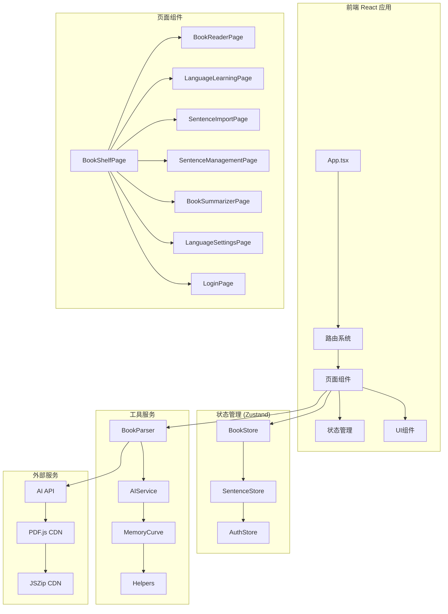
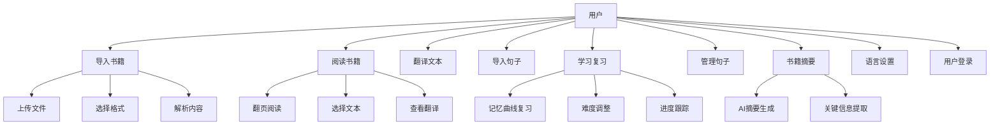
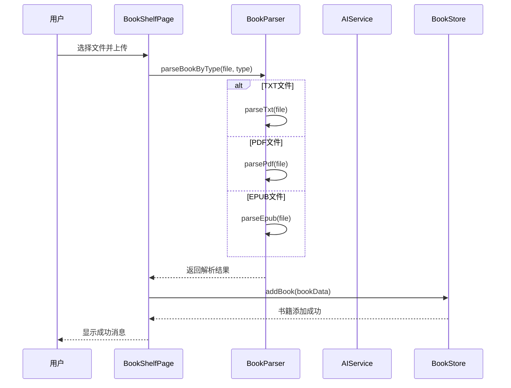
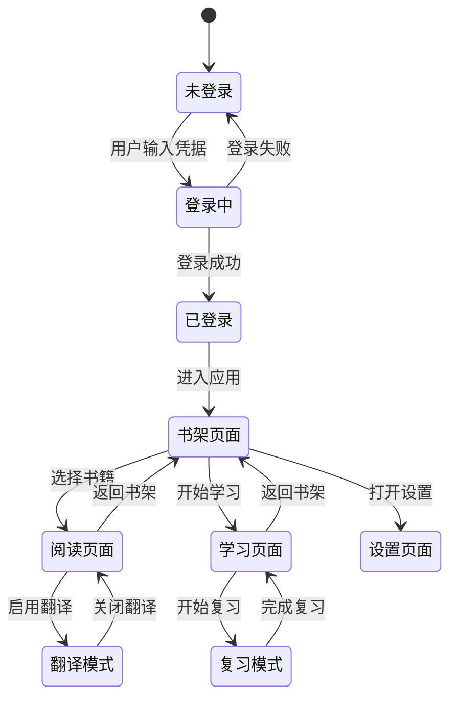
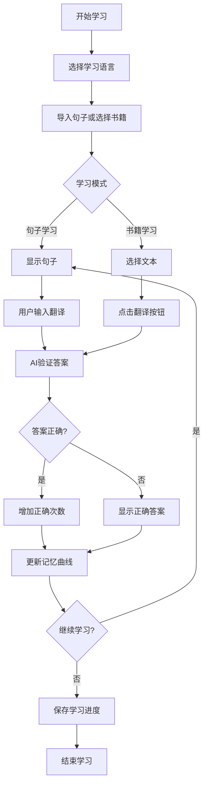
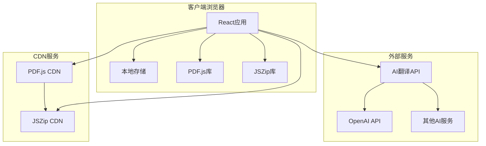
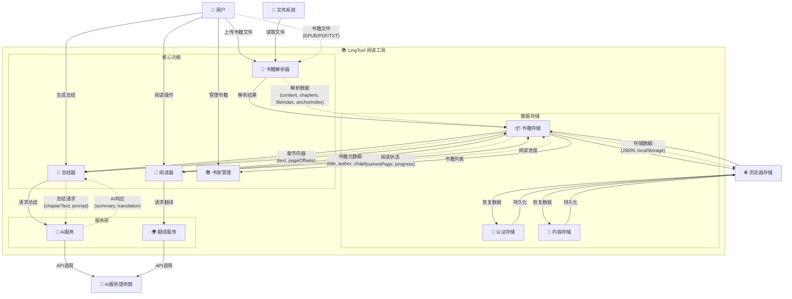
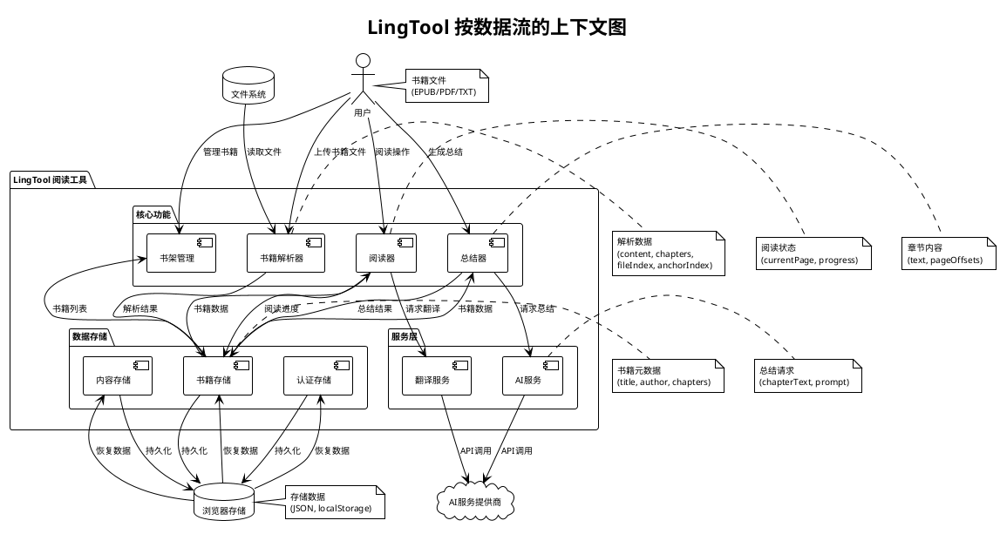

# LingTool 项目 UML 图集

## 1. 类图 (Class Diagram)

```mermaid
classDiagram
    class Book {
        +string id
        +string title
        +string author
        +string languageCode
        +string fileType
        +number totalPages
        +number currentPage
        +number readingProgress
        +number totalReadingTime
        +Date lastReadAt
        +string[] contentPages
        +string fileDataUrl
        +Chapter[] chapters
    }

    class Chapter {
        +string id
        +string title
        +number page
    }

    class Sentence {
        +string id
        +string originalText
        +string translatedText
        +string languageCode
        +string[] words
        +number difficulty
        +Date createdAt
        +Date lastReviewed
        +number reviewCount
        +number correctCount
    }

    class Word {
        +string wordText
        +string pronunciation
        +string meaning
        +string partOfSpeech
    }

    class User {
        +string id
        +string username
        +string email
        +string nativeLanguage
        +string[] learningLanguages
        +Date createdAt
    }

    class BookStore {
        +Book[] books
        +addBook(bookData) Book
        +updateBook(id, updates) void
        +deleteBook(id) void
        +getBook(id) Book
        +getRecentBooks() Book[]
    }

    class SentenceStore {
        +Sentence[] sentences
        +addSentence(sentence) Sentence
        +updateSentence(id, updates) void
        +deleteSentence(id) void
        +getSentences() Sentence[]
        +getSentencesByLanguage(lang) Sentence[]
    }

    class AuthStore {
        +User user
        +boolean isAuthenticated
        +login(credentials) void
        +logout() void
        +updateUser(updates) void
    }

    class AIService {
        -string[] endpoints
        -boolean debug
        +translateText(text, targetLang) string
        +summarizeText(text) string
        +generateQuestions(text) Question[]
        +analyzeDifficulty(text) number
    }

    class BookParser {
        +parseTxt(file) ParsedBook
        +parsePdf(file) ParsedBook
        +parseEpub(file) ParsedBook
        +parseBookByType(file, type) ParsedBook
    }

    Book ||--o{ Chapter : contains
    BookStore ||--o{ Book : manages
    SentenceStore ||--o{ Sentence : manages
    Sentence ||--o{ Word : contains
    AIService ..> Sentence : processes
    BookParser ..> Book : creates
```

## 2. 组件图 (Component Diagram)



## 3. 用例图 (Use Case Diagram)



## 4. 序列图 (Sequence Diagram) - 书籍导入流程



## 5. 状态图 (State Diagram) - 应用状态



## 6. 活动图 (Activity Diagram) - 学习流程



## 7. 部署图 (Deployment Diagram)



## 8. 按数据流的上下文图 (Context Diagram by Data Flow)

### Mermaid 版本


### PlantUML 版本


## 各图的具体用法说明

### 1. 类图 (Class Diagram)
**用途**: 展示系统中所有类的结构、属性和方法，以及类之间的关系
**用法**: 
- 理解数据模型和业务实体
- 设计数据库结构
- 规划API接口
- 代码重构时的参考

### 2. 组件图 (Component Diagram)
**用途**: 展示系统的物理结构和组件之间的依赖关系
**用法**:
- 理解系统架构
- 规划模块划分
- 识别组件间的耦合度
- 指导代码组织

### 3. 用例图 (Use Case Diagram)
**用途**: 从用户角度描述系统功能
**用法**:
- 需求分析和确认
- 功能规划
- 用户故事编写
- 测试用例设计

### 4. 序列图 (Sequence Diagram)
**用途**: 展示对象之间按时间顺序的交互
**用法**:
- 理解业务流程
- 调试复杂交互
- API设计验证
- 性能瓶颈分析

### 5. 状态图 (State Diagram)
**用途**: 展示对象或系统状态的变化
**用法**:
- 理解应用状态管理
- 设计状态机
- 处理复杂状态逻辑
- 用户体验优化

### 6. 活动图 (Activity Diagram)
**用途**: 展示业务流程和算法流程
**用法**:
- 业务流程建模
- 算法设计
- 工作流设计
- 用户操作流程优化

### 7. 部署图 (Deployment Diagram)
**用途**: 展示系统的物理部署结构
**用法**:
- 系统部署规划
- 性能优化
- 安全架构设计
- 运维管理
